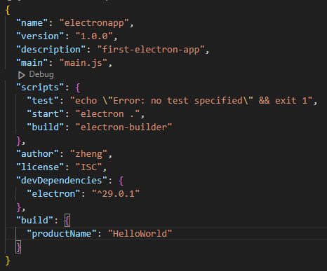
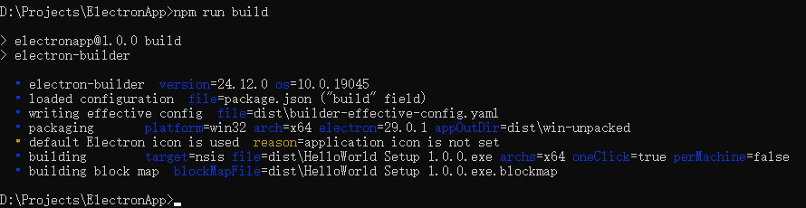
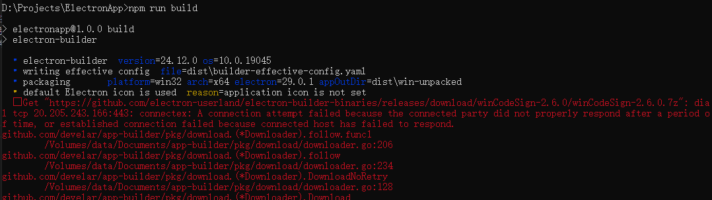

# 一、安装Electron
使用`npm`安装执行下述命令`npm install --save-dev --paltform=win32 electron`频繁失败，安装卡在下述部分无响应：

> D:\Projects\ElectronApp>npm install --save-dev electron --platform=win32
>
> [##################] / reify:@types/node: timing reifyNode:node_modules/global-agent Completed in 393ms

先后切换淘宝源、腾讯源仍未解决。

经过测试，使用`cnpm`可以成功安装，步骤如下：
1. 运行命令`npm install -g cnpm`， 安装`cnpm`。
2. 然后使用`cnpm`替换`npm`安装，命令相同。

具体原因尚不清楚, 猜测是因为网络问题。

# 二、打包分发程序

使用`electron-builder`进行打包。命令简单，可在多平台使用，本次操作平台为`Windows 10`。

## 1. 安装`electron-builder`

```
npm install -g electron-builder
```
这里采用全局安装方便以后在其他项目中使用。使用时需要在项目的`package.json`文件中的`scripts`字段中添加`build`字段指明`electron-builder`的路径。全局安装时为`electron-builder`，本地安装时为`项目地址/node_modules/.bin/electron-builder`。



## 2. 进行打包
使用`npm run build`命令开始打包。该命令会在系统目录中查找如下文件，如果查找不到，就会从`Github`下载。此时如果网络状况欠佳，会导致打包失败。可以根据报错信息自行通过其他手段下载，然后放置到对应目录，即可成功打包。默认打包位置为当前`package.json`文件路径下的`dist`文件夹。更多打包设置可以参考[官网文档](https://www.electron.build/#/)。

正确的打包结果如下：


打包时的报错信息（指出了下载失败的文件及下载地址）：


可能需要手动下载的文件及对应的保存位置：
|文件名|文件保存位置|补充说明|
|:------|:-------------|:-------------|
|electron-v29.0.1-win32-x64.zip|C:\Users\cube\AppData\Local\electron\Cache\ |-|
|nsis-3.0.4.1.7z|C:\Users\cube\AppData\Local\electron-builder\Cache\nsis\ |需解压|
|nsis-resources-3.4.1.7z|C:\Users\cube\AppData\Local\electron-builder\Cache\nsis\ |需解压|
|winCodeSign-2.6.0.7z|C:\Users\cube\AppData\Local\electron-builder\Cache\winCodeSign\ |需解压|


# 备注
## 【1】NPM 换源操作
1. 临时使用其他源
    
    命令格式为: 
    > npm install [其他npm参数] package_name --registry=[临时源地址]
    
    例如安装`cnpm`可以使用命令 
    >npm install -g cnpm --registry=https://registry.npmmirror.com

2. 长期使用其他源
    
    使用命令设置其他源，以淘宝源为例：
    > ```
    > C:\Users\cube>npm config set registry https://registry.npm.taobao.org //设置其他源
    > C:\Users\cube>npm config get registry //检查设置结果
    >   https://registry.npm.taobao.org
    > ```

3. 使用`nrm`进行源管理
    
    安装`nrm`
    > npm install -g nrm

    常用`nrm`命令
    > ```
    > C:\Users\cube>nrm ls //枚举可用的源
    >   npm ---------- https://registry.npmjs.org/
    >   yarn --------- https://registry.yarnpkg.com/
    >   tencent ------ https://mirrors.cloud.tencent.com/npm/
    >   cnpm --------- https://r.cnpmjs.org/
    > * taobao ------- https://registry.npmmirror.com/   //*标出当前使用的源
    >   npmMirror ---- https://skimdb.npmjs.com/registry/
    > 
    > C:\Users\cube>nrm use taobao //切换当前使用的源为 ‘taobao’
    >  SUCCESS  The registry has been changed to 'taobao'.
    > ```


